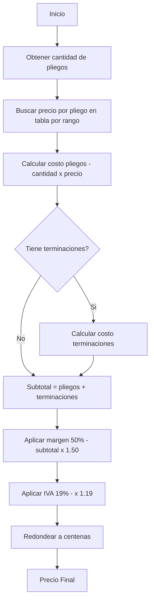
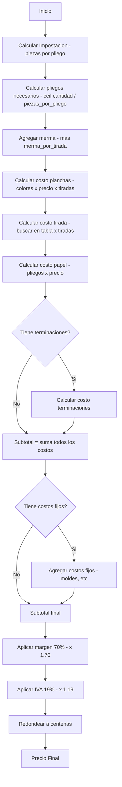
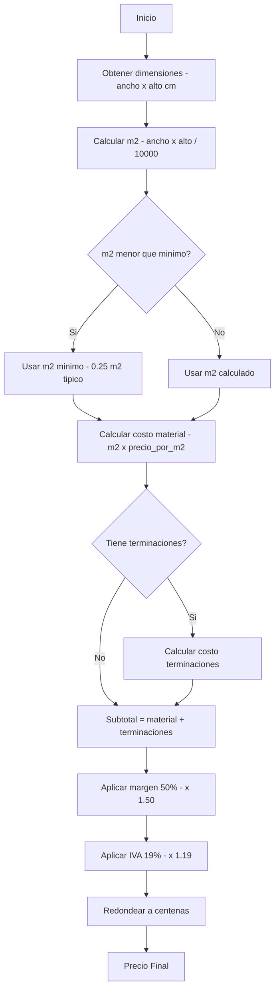
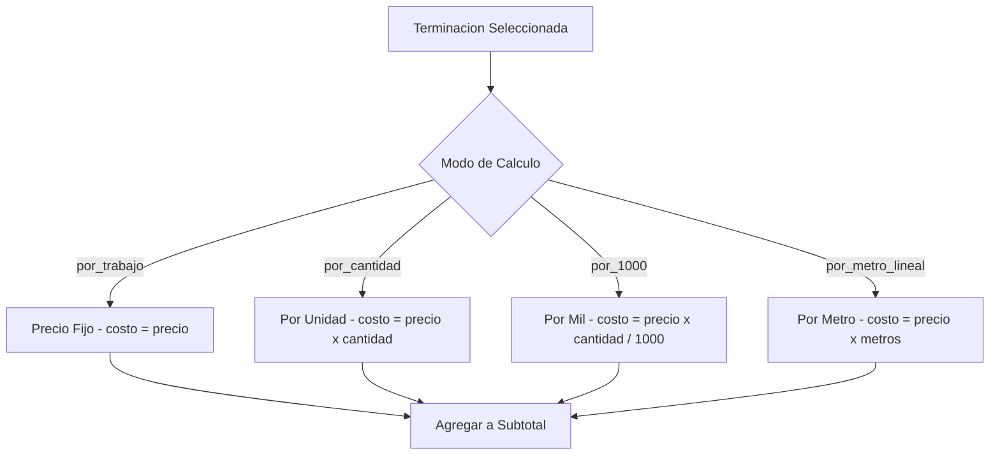

# Guía de Cálculos de Cotización

Este documento explica en detalle cómo se calcula cada valor en los distintos tipos de impresión: Digital, Offset y Plotter, así como las terminaciones.

## Tabla de Contenidos

1. [Cálculos Comunes](#cálculos-comunes)
2. [Impresión Digital](#impresión-digital)
3. [Impresión Offset](#impresión-offset)
4. [Impresión Plotter](#impresión-plotter)
5. [Terminaciones](#terminaciones)

---

## Cálculos Comunes

### Margen (Markup)

El margen es el porcentaje de ganancia aplicado sobre los costos base.

**Fórmula:**
```
monto_con_margen = monto_base × (1 + tasa_margen)
```

**Tasas utilizadas:**
- Digital: 50% (0.50)
- Offset: 70% (0.70)
- Plotter: 50% (0.50)

**Ejemplo:**
```
Monto base: $50.000
Margen 50%: $50.000 × 1.50 = $75.000
Margen 70%: $50.000 × 1.70 = $85.000
```

### IVA (Impuesto al Valor Agregado)

Se aplica sobre el monto con margen.

**Fórmula:**
```
total_con_iva = monto_con_margen × (1 + tasa_iva)
```

**Tasa IVA:** 19% (0.19) - Chile

**Ejemplo:**
```
Monto con margen: $75.000
Total con IVA: $75.000 × 1.19 = $89.250
```

### Redondeo

Todos los valores finales se redondean a la centena más cercana.

**Fórmula:**
```
redondeado = round(monto / 100) × 100
```

**Ejemplo:**
```
Monto: $76.826,40
Redondeado: $76.800
```

---

## Impresión Digital

Archivo: `src/quote/pricing/digital.py`

### 1. Costo de Pliegos (Sheet Cost)

**Fórmula:**
```
costo_pliegos = cantidad_pliegos × precio_por_pliego
```

**Parámetros:**
- `cantidad_pliegos`: Número de pliegos a imprimir
- `color_config`: Configuración de color (ej: "4/0", "4/4")
- `price_table`: Tabla de precios por rangos de cantidad

**Ejemplo de tabla de precios:**
```python
"4/0": [
    (1, 10, Decimal("1000")),      # 1-10 pliegos: $1.000 c/u
    (11, 50, Decimal("900")),      # 11-50 pliegos: $900 c/u
    (51, 100, Decimal("715")),     # 51-100 pliegos: $715 c/u
    (101, inf, Decimal("650")),    # 101+ pliegos: $650 c/u
]
```

**Cálculo:**
```
Para 75 pliegos en 4/0:
- Buscar en rango 51-100
- Precio por pliego: $715
- Costo total: 75 × $715 = $53.625
```

### 2. Costo de Terminaciones

Ver sección [Terminaciones](#terminaciones) para detalles de modos de cálculo.

### 3. Flujo Completo Digital



**Pasos:**
```
1. Calcular costo de pliegos
2. Agregar costo de terminaciones
3. Aplicar margen del 50%
4. Aplicar IVA del 19%
5. Redondear a centenas
```

**Ejemplo completo:**
```
Pliegos: 75 × $715 = $53.625
Terminaciones (corte): $3.000
Subtotal: $56.625
Con margen 50%: $84.937,50
Con IVA 19%: $101.075,63
Redondeado: $101.100
```

---

## Impresión Offset

Archivo: `src/quote/pricing/offset.py`

### 1. Impostación (Piezas por Pliego)

Determina cuántas piezas caben en un pliego considerando márgenes y sangrado.

**Fórmula:**
```
area_efectiva_ancho = ancho_pliego - 6cm  (3cm cada lado)
area_efectiva_alto = alto_pliego - 4cm   (2cm cada lado)

piezas_horizontales = floor((area_efectiva_ancho + espacio) / (ancho_pieza + espacio))
piezas_verticales = floor((area_efectiva_alto + espacio) / (alto_pieza + espacio))

piezas_por_pliego = piezas_horizontales × piezas_verticales
```

**Consideraciones:**
- Intenta orientación normal y rotada
- Usa dimensiones efectivas conservadoras para offset
- Considera gaps/espacios entre piezas

**Ejemplo:**
```
Pliego: 100cm × 70cm
Pieza: 10cm × 15cm
Espacio: 0.5cm

Area efectiva: 94cm × 66cm

Horizontales: floor((94 + 0.5) / (10 + 0.5)) = 9
Verticales: floor((66 + 0.5) / (15 + 0.5)) = 4
Piezas por pliego: 9 × 4 = 36
```

### 2. Pliegos Totales con Merma

**Fórmula:**
```
pliegos_necesarios = ceil(cantidad / piezas_por_pliego)
merna_total = merma_por_tirada × numero_tiradas
pliegos_totales = pliegos_necesarios + merna_total
```

**Ejemplo:**
```
Cantidad: 5.000 unidades
Piezas por pliego: 36
Merma por tirada: 300
Número de tiradas: 1

Pliegos necesarios: ceil(5000 / 36) = 139
Merma total: 300 × 1 = 300
Pliegos totales: 139 + 300 = 439
```

### 3. Costo de Planchas (Plates Cost)

**Fórmula:**
```
cantidad_colores = suma(config_color)  # "4/0" = 4, "4/4" = 8
costo_planchas = cantidad_colores × precio_por_color × numero_tiradas
```

**Ejemplo:**
```
Configuración: 4/4 (8 colores total)
Precio por color: $7.000
Tiradas: 1

Costo planchas: 8 × $7.000 × 1 = $56.000
```

### 4. Costo de Tirada (Run Cost)

**Fórmula:**
```
costo_por_tirada = buscar_precio_por_cantidad(pliegos_por_tirada, tabla_precios)
costo_total_tirada = costo_por_tirada × numero_tiradas
```

**Ejemplo de tabla:**
```python
{
    1000: Decimal("50000"),   # Hasta 1000 pliegos: $50.000
    2000: Decimal("80000"),   # Hasta 2000 pliegos: $80.000
    5000: Decimal("170000"),  # Hasta 5000 pliegos: $170.000
}
```

**Ejemplo:**
```
Pliegos por tirada: 5.000
Búsqueda: <= 5000 → $170.000
Tiradas: 1

Costo tirada: $170.000 × 1 = $170.000
```

### 5. Costo de Papel

**Fórmula:**
```
costo_papel = pliegos_totales × precio_por_pliego
```

**Nota:** En la implementación actual, esto puede calcularse inversamente para cumplir con subtotales objetivo.

### 6. Costo de Terminaciones

Ver sección [Terminaciones](#terminaciones).

### 7. Costos Fijos (Fixed Costs)

Costos únicos como moldes para troquel.

**Ejemplo:**
```
Molde troquel: $20.000 (pago único)
```

### 8. Flujo Completo Offset



**Pasos:**
```
1. Calcular impostación (piezas por pliego)
2. Calcular pliegos necesarios con merma
3. Calcular costo de planchas
4. Calcular costo de tirada
5. Calcular costo de papel
6. Agregar costo de terminaciones
7. Agregar costos fijos (si aplica)
8. Subtotal = suma de todos los costos
9. Aplicar margen del 70%
10. Aplicar IVA del 19%
11. Redondear a centenas
```

**Ejemplo completo:**
```
Impostación: 36 piezas/pliego
Pliegos: 439 (139 + 300 merma)
Planchas (4/4): $56.000
Tirada: $170.000
Papel: $200.000
Troquel (por 1000): $60.000 × 5 = $300.000
Molde troquel: $20.000
Subtotal: $746.000
Con margen 70%: $1.268.200
Con IVA 19%: $1.509.158
Redondeado: $1.509.200
```

---

## Impresión Plotter

Archivo: `src/quote/pricing/plotter.py`

### 1. Cálculo de Metros Cuadrados

**Fórmula:**
```
m2 = (ancho_cm × alto_cm) / 10.000
```

**Ejemplo:**
```
Dimensiones: 70cm × 50cm
m2 = (70 × 50) / 10.000 = 3.500 / 10.000 = 0.35 m²
```

### 2. Cargo Mínimo

Si el m² calculado es menor al mínimo establecido, se cobra el mínimo.

**Fórmula:**
```
m2_cobrables = max(m2_real, m2_minimo)
```

**Mínimo típico:** 0.25 m²

**Ejemplo:**
```
m2 real: 0.15
m2 mínimo: 0.25
m2 cobrables: 0.25
```

### 3. Costo de Material

**Fórmula:**
```
costo_material = m2_cobrables × precio_por_m2
```

**Ejemplo de precios:**
```python
{
    "sintetico": Decimal("8500"),      # $8.500/m²
    "lona_pvc": Decimal("8500"),       # $8.500/m²
    "papel_adhesivo": Decimal("6000"), # $6.000/m²
}
```

**Ejemplo:**
```
m2: 0.35
Material: Sintético ($8.500/m²)

Costo: 0.35 × $8.500 = $2.975
```

### 4. Flujo Completo Plotter



**Pasos:**
```
1. Calcular m² reales
2. Aplicar cargo mínimo si corresponde
3. Calcular costo de material
4. Agregar costo de terminaciones
5. Aplicar margen del 50%
6. Aplicar IVA del 19%
7. Redondear a centenas
```

**Ejemplo completo:**
```
m²: 0.35
Material (sintético): 0.35 × $8.500 = $2.975
Corte recto: $1.000
Subtotal: $3.975
Con margen 50%: $5.962,50
Con IVA 19%: $7.095,38
Redondeado: $7.100
```

---

## Terminaciones

Las terminaciones son procesos adicionales aplicados al producto impreso.

### Modos de Cálculo



Todas las terminaciones usan uno de estos tres modos:

#### 1. Por Trabajo (por_trabajo)

Precio fijo por trabajo, independiente de la cantidad.

**Fórmula:**
```
costo = precio
```

**Ejemplo:**
```
Corte recto: $3.000 (por trabajo)
- Para 100 unidades: $3.000
- Para 10.000 unidades: $3.000
```

#### 2. Por Cantidad (por_cantidad)

Precio por unidad.

**Fórmula:**
```
costo = precio × cantidad
```

**Ejemplo:**
```
Ojetillos: $500 por unidad
Cantidad: 1.000

Costo: $500 × 1.000 = $500.000
```

#### 3. Por Mil (por_1000)

Precio por cada mil unidades.

**Fórmula:**
```
costo = precio × cantidad / 1.000
```

**Ejemplo:**
```
Troquel: $60.000 por cada 1.000
Cantidad: 5.000

Costo: $60.000 × 5.000 / 1.000 = $300.000
```

#### 4. Por Metro Lineal (por_metro_lineal) - Solo Plotter

Precio por metro lineal (usado principalmente en plotter).

**Fórmula:**
```
costo = precio × metros_lineales
```

**Ejemplo:**
```
Soldadura: $5.000 por metro lineal
Metros: 10

Costo: $5.000 × 10 = $50.000
```

### Tipos de Terminaciones

| Terminación | Descripción | Modo Típico |
|-------------|-------------|-------------|
| **Corte Recto** | Corte simple del material | por_trabajo |
| **Troquel** | Corte con forma personalizada | por_1000 |
| **Laminado** | Lámina protectiva sobre impresión | por_trabajo / por_1000 |
| **Ojetillos** | Ojetes metálicos para colgar | por_cantidad |
| **Corchete** | Encuadernación con corchetes | por_trabajo |
| **Doblado** | Pliegues en el material | por_trabajo |
| **Pegado** | Pegado de piezas | por_trabajo |

### Configuración de Terminaciones

#### Ejemplo Digital:
```python
{
    "corte_recto": {
        "mode": "por_trabajo",
        "price": Decimal("3000")
    },
    "doblado": {
        "mode": "por_trabajo",
        "price": Decimal("15000")
    }
}
```

#### Ejemplo Offset:
```python
{
    "troquel": {
        "mode": "por_1000",
        "price": Decimal("60000"),
        "molde": Decimal("20000")  # Costo fijo del molde
    },
    "corte_recto": {
        "mode": "por_trabajo",
        "price": Decimal("10000")
    },
    "corchete": {
        "mode": "por_trabajo",
        "price": Decimal("55000")
    },
    "laminado": {
        1000: Decimal("25000"),    # Tabla escalonada
        2000: Decimal("40000"),
        5000: Decimal("70000"),
    }
}
```

#### Ejemplo Plotter:
```python
{
    "corte_recto": {
        "mode": "por_trabajo",
        "price": Decimal("1000")
    },
    "ojetillos": {
        "mode": "por_cantidad",
        "price": Decimal("500")
    },
    "soldadura": {
        "mode": "por_metro_lineal",
        "price": Decimal("5000")
    }
}
```

### Costos Fijos en Terminaciones

Algunas terminaciones tienen costos fijos adicionales:

**Ejemplo - Molde de Troquel:**
```
Costo de terminación: $60.000 × cantidad / 1000
Costo fijo molde: $20.000 (único)

Total = costo_terminación + costo_fijo
```

---

## Resumen de Fórmulas

### Digital
```python
sheet_cost = sheets × price_per_sheet
finishing_cost = según modo (por_trabajo/por_cantidad/por_1000)
subtotal = sheet_cost + finishing_cost
with_markup = subtotal × 1.50
with_iva = with_markup × 1.19
final = round_to_hundreds(with_iva)
```

### Offset
```python
pieces_per_sheet = calculate_imposition()
sheets_needed = ceil(quantity / pieces_per_sheet)
total_sheets = sheets_needed + (merma_per_run × num_runs)
plates_cost = num_colors × price_per_color × num_runs
run_cost = lookup_price(sheets_per_run) × num_runs
paper_cost = total_sheets × price_per_sheet
finishing_cost = según modo
fixed_costs = moldes, etc.
subtotal = plates_cost + run_cost + paper_cost + finishing_cost + fixed_costs
with_markup = subtotal × 1.70
with_iva = with_markup × 1.19
final = round_to_hundreds(with_iva)
```

### Plotter
```python
m2 = (width_cm × height_cm) / 10000
billable_m2 = max(m2, minimum_m2)
material_cost = billable_m2 × price_per_m2
finishing_cost = según modo
subtotal = material_cost + finishing_cost
with_markup = subtotal × 1.50
with_iva = with_markup × 1.19
final = round_to_hundreds(with_iva)
```

---

## Notas Importantes

1. **Usar Decimal**: Siempre usar `decimal.Decimal` para valores monetarios, nunca `float`.

2. **Redondeo**: Todos los valores finales se redondean a la centena más cercana.

3. **IVA Chile**: La tasa estándar es 19%.

4. **Merma Offset**: Siempre se agrega merma por tirada (ej: 300 pliegos por tirada).

5. **Cargo Mínimo Plotter**: Siempre existe un m² mínimo cobrable (típicamente 0.25 m²).

6. **Margen Offset Mayor**: El offset tiene un margen mayor (70%) comparado con digital y plotter (50%).

7. **Tablas de Precios**: Las búsquedas en tablas escalonadas siempre buscan el tier más bajo que cubra la cantidad solicitada.

8. **Impostación Offset**: El offset usa márgenes conservadores (6cm ancho total, 4cm alto total) para asegurar viabilidad de impresión.
